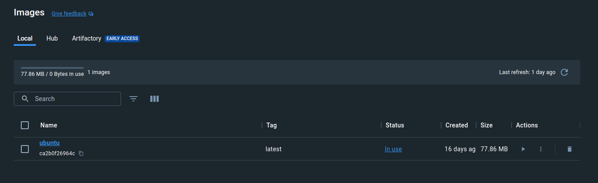

# Basics

## Creating containers

`docker run -i -t ubuntu /bin/bash`

* `run` - running new container (appropriate image will be downloaded if has not been downloaded yet)
* `-i` - interactively
* `-t` - attached to host's terminal (user can provide input using the keyboard and see the output)
* `ubuntu` - used image
* `bin/bash` - executed by the container after start

```bash
$ docker run -i -t ubuntu /bin/bash
Unable to find image 'ubuntu:latest' locally
latest: Pulling from library/ubuntu
bccd10f490ab: Pull complete
Digest: sha256:77906da86b60585ce12215807090eb327e7386c8fafb5402369e421f44eff17e
Status: Downloaded newer image for ubuntu:latest
root@bcdbfe3ec6c4:/# ls
bin  boot  dev  etc  home  lib  lib32  lib64  libx32  media  mnt  opt  proc  root  run  sbin  srv  sys  tmp  usr  var
root@bcdbfe3ec6c4:/# cat /etc/issue
Ubuntu 22.04.4 LTS \n \l
```




```bash
root@bcdbfe3ec6c4:/# exit
exit
```


## Starting containers

`docker start exciting_mcnulty`

* `start` - starting previously created container
* `exciting_mcnulty` - name od the particular container

```bash
$ docker start exciting_mcnulty
exciting_mcnulty
```


`docker start -i exciting_mcnulty`

* `-i` - interactively

```bash
$ docker start -i exciting_mcnulty
root@bcdbfe3ec6c4:/# pwd
/
root@bcdbfe3ec6c4:/# ls
bin  boot  dev  etc  home  lib  lib32  lib64  libx32  media  mnt  opt  proc  root  run  sbin  srv  sys  tmp  usr  var
root@bcdbfe3ec6c4:/# exit
exit
```

## Stopping containers

`docker stop exciting_mcnulty`

* `stop` - stopping created container
* `exciting_mcnulty` - name od the particular container

```bash
$ docker stop exciting_mcnulty
exciting_mcnulty
```


## Ports mapping

`docker run -p 8088:80 docker/welcome-to-docker`

* `run` - running new container
* `-p 8088:80` - mapping port 8088 on the Docker host to TCP port 80 in the container
* `docker/welcome-to-docker` - a particular container to download from the Docker Hub to the registry

```bash
$ docker run -p 8088:80 docker/welcome-to-docker
Unable to find image 'docker/welcome-to-docker:latest' locally
latest: Pulling from docker/welcome-to-docker
96526aa774ef: Already exists
740091335c74: Pull complete
da9c2e764c5b: Pull complete
ade17ad21ef4: Pull complete
4e6f462c8a69: Pull complete
1324d9977cd2: Pull complete
1b9b96da2c74: Pull complete
5d329b1e101a: Pull complete
Digest: sha256:eedaff45e3c78538087bdd9dc7afafac7e110061bbdd836af4104b10f10ab693
Status: Downloaded newer image for docker/welcome-to-docker:latest
/docker-entrypoint.sh: /docker-entrypoint.d/ is not empty, will attempt to perform configuration
/docker-entrypoint.sh: Looking for shell scripts in /docker-entrypoint.d/
/docker-entrypoint.sh: Launching /docker-entrypoint.d/10-listen-on-ipv6-by-default.sh
10-listen-on-ipv6-by-default.sh: info: Getting the checksum of /etc/nginx/conf.d/default.conf
10-listen-on-ipv6-by-default.sh: info: Enabled listen on IPv6 in /etc/nginx/conf.d/default.conf
/docker-entrypoint.sh: Sourcing /docker-entrypoint.d/15-local-resolvers.envsh
/docker-entrypoint.sh: Launching /docker-entrypoint.d/20-envsubst-on-templates.sh
/docker-entrypoint.sh: Launching /docker-entrypoint.d/30-tune-worker-processes.sh
/docker-entrypoint.sh: Configuration complete; ready for start up
2024/03/30 20:46:21 [notice] 1#1: using the "epoll" event method
2024/03/30 20:46:21 [notice] 1#1: nginx/1.25.3
2024/03/30 20:46:21 [notice] 1#1: built by gcc 12.2.1 20220924 (Alpine 12.2.1_git20220924-r10)
2024/03/30 20:46:21 [notice] 1#1: OS: Linux 6.4.16-linuxkit
2024/03/30 20:46:21 [notice] 1#1: getrlimit(RLIMIT_NOFILE): 1048576:1048576
2024/03/30 20:46:21 [notice] 1#1: start worker processes
2024/03/30 20:46:21 [notice] 1#1: start worker process 30
2024/03/30 20:46:21 [notice] 1#1: start worker process 31
2024/03/30 20:46:21 [notice] 1#1: start worker process 32
2024/03/30 20:46:21 [notice] 1#1: start worker process 33
2024/03/30 20:46:29 [notice] 1#1: signal 28 (SIGWINCH) received
2024/03/30 20:46:29 [notice] 1#1: signal 28 (SIGWINCH) received
2024/03/30 20:46:29 [notice] 1#1: signal 28 (SIGWINCH) received
2024/03/30 20:46:29 [notice] 1#1: signal 28 (SIGWINCH) received

```


```bash
172.17.0.1 - - [30/Mar/2024:20:46:53 +0000] "GET / HTTP/1.1" 200 651 "-" "Mozilla/5.0 (X11; Linux x86_64) AppleWebKit/537.36 (KHTML, like Gecko) Chrome/123.0.0.0 Safari/537.36 OPR/109.0.0.0" "-"
172.17.0.1 - - [30/Mar/2024:20:46:53 +0000] "GET /static/css/main.27312bf9.css HTTP/1.1" 200 791 "http://localhost:8088/" "Mozilla/5.0 (X11; Linux x86_64) AppleWebKit/537.36 (KHTML, like Gecko) Chrome/123.0.0.0 Safari/537.36 OPR/109.0.0.0" "-"
172.17.0.1 - - [30/Mar/2024:20:46:53 +0000] "GET /static/js/main.c9e951e4.js HTTP/1.1" 200 382506 "http://localhost:8088/" "Mozilla/5.0 (X11; Linux x86_64) AppleWebKit/537.36 (KHTML, like Gecko) Chrome/123.0.0.0 Safari/537.36 OPR/109.0.0.0" "-"
172.17.0.1 - - [30/Mar/2024:20:46:54 +0000] "GET /favicon.ico HTTP/1.1" 200 15086 "http://localhost:8088/" "Mozilla/5.0 (X11; Linux x86_64) AppleWebKit/537.36 (KHTML, like Gecko) Chrome/123.0.0.0 Safari/537.36 OPR/109.0.0.0" "-"
2024/03/30 20:48:14 [notice] 1#1: signal 28 (SIGWINCH) received
2024/03/30 20:48:14 [notice] 1#1: signal 28 (SIGWINCH) received
2024/03/30 20:48:14 [notice] 1#1: signal 28 (SIGWINCH) received
2024/03/30 20:48:14 [notice] 1#1: signal 28 (SIGWINCH) received
^C2024/03/30 20:48:23 [notice] 1#1: signal 2 (SIGINT) received, exiting
2024/03/30 20:48:23 [notice] 31#31: exiting
2024/03/30 20:48:23 [notice] 32#32: exiting
2024/03/30 20:48:23 [notice] 31#31: exit
2024/03/30 20:48:23 [notice] 32#32: exit
2024/03/30 20:48:23 [notice] 30#30: exiting
2024/03/30 20:48:23 [notice] 30#30: exit
2024/03/30 20:48:23 [notice] 33#33: exiting
2024/03/30 20:48:23 [notice] 33#33: exit
2024/03/30 20:48:23 [notice] 1#1: signal 17 (SIGCHLD) received from 30
2024/03/30 20:48:23 [notice] 1#1: worker process 30 exited with code 0
2024/03/30 20:48:23 [notice] 1#1: signal 29 (SIGIO) received
2024/03/30 20:48:23 [notice] 1#1: signal 17 (SIGCHLD) received from 32
2024/03/30 20:48:23 [notice] 1#1: worker process 32 exited with code 0
2024/03/30 20:48:23 [notice] 1#1: signal 29 (SIGIO) received
2024/03/30 20:48:23 [notice] 1#1: signal 17 (SIGCHLD) received from 31
2024/03/30 20:48:23 [notice] 1#1: worker process 31 exited with code 0
2024/03/30 20:48:23 [notice] 1#1: signal 29 (SIGIO) received
2024/03/30 20:48:23 [notice] 1#1: signal 17 (SIGCHLD) received from 33
2024/03/30 20:48:23 [notice] 1#1: worker process 33 exited with code 0
2024/03/30 20:48:23 [notice] 1#1: exit
```

`docker run -d -p 8080:80 docker/getting-started`

* `run` - running new container
* `-d` - detached mode (running in the background)
* `-p 8080:80` - mapping port 8088 on the Docker host to TCP port 80 in the container
* `docker/getting-started` - a particular container to download from the Docker Hub to the registry

```bash
$ docker run -d -p 8080:80 docker/getting-started
Unable to find image 'docker/getting-started:latest' locally
latest: Pulling from docker/getting-started
c158987b0551: Pull complete
1e35f6679fab: Pull complete
cb9626c74200: Pull complete
b6334b6ace34: Pull complete
f1d1c9928c82: Pull complete
9b6f639ec6ea: Pull complete
ee68d3549ec8: Pull complete
33e0cbbb4673: Pull complete
4f7e34c2de10: Pull complete
Digest: sha256:d79336f4812b6547a53e735480dde67f8f8f7071b414fbd9297609ffb989abc1
Status: Downloaded newer image for docker/getting-started:latest
86f7b7b6ad16a59486b9fb623597774a54d2d9fa35f86fed640a82fbb3cf37ce
```


## Listing containers

`docker ps`

* `ps` - listing containers

```bash
$ docker ps
CONTAINER ID   IMAGE                    COMMAND                  CREATED          STATUS          PORTS                  NAMES
708ca9a129d4   docker/getting-started   "/docker-entrypoint.…"   36 minutes ago   Up 36 minutes   0.0.0.0:8080->80/tcp   upbeat_engelbart
```

`docker ps -a`

* `ps` - listing containers
* `-a` - all (also not running)

```bash
$ docker ps -a
CONTAINER ID   IMAGE                      COMMAND                  CREATED          STATUS                    PORTS                  NAMES
708ca9a129d4   docker/getting-started     "/docker-entrypoint.…"   37 minutes ago   Up 37 minutes             0.0.0.0:8080->80/tcp   upbeat_engelbart
472d1a966432   docker/welcome-to-docker   "/docker-entrypoint.…"   2 hours ago      Exited (0) 2 hours ago                           angry_merkle
bcdbfe3ec6c4   ubuntu                     "/bin/bash"              2 weeks ago      Exited (0) 23 hours ago                          exciting_mcnulty
```


## Listing images

`docker images`

* `images` - list all downloaded images

```bash
$ docker image ls
REPOSITORY                 TAG       IMAGE ID       CREATED         SIZE
ubuntu                     latest    ca2b0f26964c   4 weeks ago     77.9MB
docker/welcome-to-docker   latest    c1f619b6477e   4 months ago    18.6MB
docker/getting-started     latest    3e4394f6b72f   15 months ago   47MB
```

`docker image ls`

* `image ls` - list all downloaded images

```bash
$ docker image ls
REPOSITORY                 TAG       IMAGE ID       CREATED         SIZE
ubuntu                     latest    ca2b0f26964c   4 weeks ago     77.9MB
docker/welcome-to-docker   latest    c1f619b6477e   4 months ago    18.6MB
docker/getting-started     latest    3e4394f6b72f   15 months ago   47MB
```


