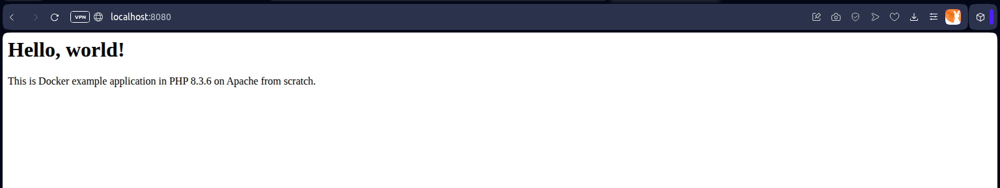

# Example: Hello World web application in PHP on Apache from scratch

## Naive approach

### Creating Dockerfile

[**Dockerfile**](Dockerfile-naive)

```dockerfile
FROM ubuntu:latest

RUN apt update && apt upgrade -y \
    && apt install -y php8.3-fpm apache2 libapache2-mod-fcgid \
    && a2enmod proxy_fcgi && a2enconf php8.3-fpm

COPY site.conf /etc/apache2/sites-available/
COPY index.php /var/www/hello-php-apache-from-scratch/public/

RUN a2dissite 000-default.conf && a2ensite site.conf

EXPOSE 80

CMD service php8.3-fpm start && apachectl -D FOREGROUND

```

### Preparing PHP application sample

[**index.php**](index.php)

```html
<h1>Hello, world!</h1>
<p>This is Docker example application in PHP <?php echo phpversion(); ?> on Apache from scratch.</p>

```

[**site.conf**](site.conf)

```apache
<VirtualHost *:80>
    ServerName hello-php-apache-from-scratch.local
    DocumentRoot /var/www/hello-php-apache-from-scratch/public

    <Directory "/var/www/hello-php-apache-from-scratch/public">
        Options Indexes FollowSymLinks
        AllowOverride All
        Require all granted
    </Directory>

    <FilesMatch \.php$>
        <If "-f %{REQUEST_FILENAME}">
            SetHandler "proxy:unix:/var/run/php/php8.3-fpm.sock|fcgi://localhost"
        </If>
    </FilesMatch>
</VirtualHost>
```

### Building image

`docker build -t hello-php-apache-from-scratch -f Dockerfile-naive .`

* `build` - building a container
* `-t` tags an image with a name
* `hello-php-apache-from-scratch` - image name
* `-f` - points out the Dockerfile
* `Dockerfile-naive` - Dockerfile name
* `.` - building context (with all remaining files)

```console
$ docker build -t hello-php-apache-from-scratch -f Dockerfile-naive .
[+] Building 142.1s (11/11) FINISHED                                                                                                                                                                                                                               docker:default
 => [internal] load build definition from Dockerfile                                                                                                                                                                                                                         0.0s
 => => transferring dockerfile: 437B                                                                                                                                                                                                                                         0.0s
 => [internal] load metadata for docker.io/library/ubuntu:latest                                                                                                                                                                                                            18.4s
 => [auth] library/ubuntu:pull token for registry-1.docker.io                                                                                                                                                                                                                0.0s
 => [internal] load .dockerignore                                                                                                                                                                                                                                            0.0s
 => => transferring context: 51B                                                                                                                                                                                                                                             0.0s
 => CACHED [1/5] FROM docker.io/library/ubuntu:latest@sha256:353675e2a41babd526e2b837d7ec780c2a05bca0164f7ea5dbbd433d21d166fc                                                                                                                                                0.0s
 => => resolve docker.io/library/ubuntu:latest@sha256:353675e2a41babd526e2b837d7ec780c2a05bca0164f7ea5dbbd433d21d166fc                                                                                                                                                       0.0s
 => [internal] load build context                                                                                                                                                                                                                                            0.0s
 => => transferring context: 59B                                                                                                                                                                                                                                             0.0s
 => [2/5] RUN apt update && apt upgrade -y     && apt install -y php8.3-fpm apache2 libapache2-mod-fcgid     && a2enmod proxy_fcgi && a2enconf php8.3-fpm                                                                                                                  111.2s
 => [3/5] COPY site.conf /etc/apache2/sites-available/                                                                                                                                                                                                                       0.1s
 => [4/5] COPY index.php /var/www/hello-php-apache-from-scratch/public/                                                                                                                                                                                                      0.1s
 => [5/5] RUN a2dissite 000-default.conf && a2ensite site.conf                                                                                                                                                                                                               1.0s
 => exporting to image                                                                                                                                                                                                                                                      10.9s
 => => exporting layers                                                                                                                                                                                                                                                     10.9s
 => => writing image sha256:8d864e797428938ead203b7f199b57c33c7495b75311b24d7aff6af71d56b89b                                                                                                                                                                                 0.0s
 => => naming to docker.io/library/hello-php-apache-from-scratch                                                                                                                                                                                                             0.0s

 1 warning found (use docker --debug to expand):
 - JSONArgsRecommended: JSON arguments recommended for CMD to prevent unintended behavior related to OS signals (line 14)
```

```console
$ docker images
REPOSITORY                      TAG       IMAGE ID       CREATED          SIZE
hello-php-apache-from-scratch   latest    8d864e797428   31 seconds ago   348MB
```

### Creating container

`docker run -d -p 8080:80 --name hello-world-in-php-on-apache-from-scratch hello-php-apache-from-scratch`

* `run` - running new container
* `-d` - detached mode (running in the background)
* `-p 8080:80` - mapping port 8080 on the Docker host to TCP port 80 in the container
* `--name hello-world-in-php-on-apache-from-scratch` - container name
* `hello-php-apache-from-scratch` - a particular local image

```console
$ docker run -d -p 8080:80 --name hello-world-in-php-on-apache-from-scratch hello-php-apache-from-scratch
99fa215c1a1360d9ff86a313d8565d38b8302512933b5a264602202d48186a23
```

```console
$ docker ps -a
CONTAINER ID   IMAGE                           COMMAND                  CREATED         STATUS         PORTS                                     NAMES
99fa215c1a13   hello-php-apache-from-scratch   "/bin/sh -c 'service…"   2 minutes ago   Up 2 minutes   0.0.0.0:8080->80/tcp, [::]:8080->80/tcp   hello-world-in-php-on-apache-from-scratch
```



### Remarks regarding good practices

That was very simple and naive version of the Dockerfile with *shell form* of the `CMD` instruction. Better approach would use the recommended *exec form* of the `CMD` but it requires single process running, e.g. `CMD ["apachectl", "-D", "FOREGROUND"]` and Dockerfile can contain only one `CMD` instruction. One solution is to put both processes running in the script file and run it in the `CMD` instruction. One can also create two images - first for PHP-FPM, second for Apache - and use the first image as the base for the second one.

## Better approach

### Creating Dockerfile

[**Dockerfile**](Dockerfile-better)

```dockerfile
FROM ubuntu:latest

RUN apt update && apt upgrade -y \
    && apt install -y php8.3-fpm apache2 libapache2-mod-fcgid \
    && a2enmod proxy_fcgi && a2enconf php8.3-fpm

COPY site.conf /etc/apache2/sites-available/
COPY index.php /var/www/hello-php-apache-from-scratch/public/

RUN a2dissite 000-default.conf && a2ensite site.conf

EXPOSE 80

COPY start-services.sh /usr/local/bin/
RUN chmod +x /usr/local/bin/start-services.sh

CMD ["/usr/local/bin/start-services.sh"]

```

### Preparing services script

[**start-services.sh**](start-services.sh)

```bash
#!/bin/bash
service php8.3-fpm start
exec apachectl -D FOREGROUND

```

Building image and running containner are the same as in the previous version but the Dockerfile name must be changed to `Dockerfile.better`.
(Don't forget about removing previously created container and image or use different names.)
