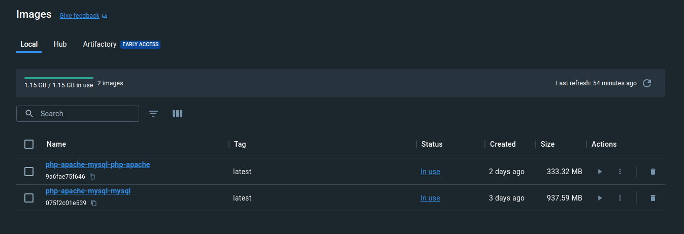
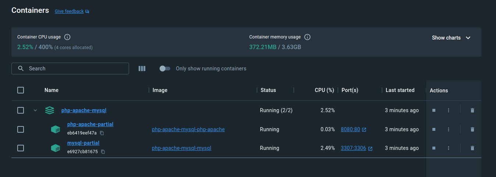
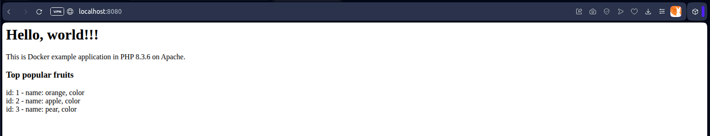

# Example application: Hello World in PHP on Apache with MySQL from scratch - multi-container

## Configuring MySQL image

### Creating Dockerfile

**Dockerfile**

```dockerfile
FROM ubuntu:23.10

RUN apt -y update
RUN apt -y upgrade
RUN apt -y install mysql-server-8.0

RUN sed -i "s|bind-address		= 127.0.0.1|#bind-address		= 127.0.0.1 |g" /etc/mysql/mysql.conf.d/mysqld.cnf

COPY database.sql /var/tmp/
RUN service mysql start && \
    echo "source /var/tmp/database.sql" | mysql

EXPOSE 3306

CMD mysqld_safe

```

### Preparing SQL script

**database.sql**

```sql
CREATE DATABASE hello;

CREATE USER 'hello' IDENTIFIED BY 'hello';
GRANT ALL ON hello.* TO 'hello'@'%';

USE hello;
CREATE TABLE fruits (
    id int AUTO_INCREMENT PRIMARY KEY,
    name varchar(255),
    colour varchar(255)
);
INSERT INTO fruits
    (name, colour)
VALUES
    ('orange', 'orange'),
    ('apple', 'red'),
    ('pear', 'yellow');

```

## Configuring PHP & Apache image

### Creating Dockerfile

**Dockerfile**

```dockerfile
FROM ubuntu:23.10

RUN apt -y update
RUN apt -y upgrade
RUN apt -y install php8.2-fpm
RUN apt -y install apache2
RUN apt -y install libapache2-mod-fcgid
RUN apt -y install php8.2-mysql

RUN a2enmod proxy_fcgi
RUN a2enconf php8.2-fpm

RUN mkdir -p /var/www/hello-php-and-apache/public
RUN chmod -R 755 /var/www
COPY site.conf /etc/apache2/sites-available/
COPY index.php /var/www/hello-php-and-apache/public

RUN a2dissite 000-default.conf
RUN a2ensite site.conf

EXPOSE 80

CMD service php8.2-fpm start; apachectl -D FOREGROUND

```

### Preparing PHP application sample

**index.php**

```php
<h1>Hello, world!!!</h1>
<p>This is Docker example application in PHP <?php echo phpversion(); ?> on Apache.</p>

<?php
$connection = new mysqli('mysql', 'hello', 'hello', 'hello');
if ($connection->connect_error) {
  die('Database connection failed: ' . $connection->connect_error);
}
echo('<h3>Top popular fruits</h3>');
$result = $connection->query('SELECT * FROM fruits');
if ($result->num_rows > 0) {
  while($row = $result->fetch_assoc()) {
    echo('<div>id: ' . $row['id']. ' - name: ' . $row['name']. ', color ' . $row['color']. '</div>');
  }
} else {
  echo("<p>No items in the database.</p>");
}
$connection->close();
?>

```

## Creating multicontainer

### Preparing compose.yaml

**compose.yaml**

```dockerfile
name: php-apache-mysql

services:

  php-apache:
    container_name: php-apache-partial
    build:
      context: ./php-apache
    ports:
      - "8080:80"

  mysql:
    container_name: mysql-partial
    build:
      context: ./mysql
    ports:
      - "3307:3306"

```

### Running multi-container

`docker compose up -d`

* `compose` - manage multi-container
* `up` - creating and starting multi-container
* `-d` - detached mode (running in the background)

```bash
$ docker compose up -d
[+] Building 2.1s (28/28) FINISHED                                                                                                                                                                                                                           docker:desktop-linux
 => [php-apache internal] load .dockerignore                                                                                                                                                                                                                                 0.1s
 => => transferring context: 2B                                                                                                                                                                                                                                              0.0s
 => [php-apache internal] load build definition from Dockerfile                                                                                                                                                                                                              0.0s
 => => transferring dockerfile: 567B                                                                                                                                                                                                                                         0.0s
 => [mysql internal] load .dockerignore                                                                                                                                                                                                                                      0.0s
 => => transferring context: 2B                                                                                                                                                                                                                                              0.0s
 => [mysql internal] load build definition from Dockerfile                                                                                                                                                                                                                   0.1s
 => => transferring dockerfile: 374B                                                                                                                                                                                                                                         0.0s
 => [php-apache internal] load metadata for docker.io/library/ubuntu:23.10                                                                                                                                                                                                   1.4s
 => [php-apache  1/15] FROM docker.io/library/ubuntu:23.10@sha256:5cd569b792a8b7b483d90942381cd7e0b03f0a15520d6e23fb7a1464a25a71b1                                                                                                                                           0.0s
 => [mysql internal] load build context                                                                                                                                                                                                                                      0.1s
 => => transferring context: 34B                                                                                                                                                                                                                                             0.0s
 => [php-apache internal] load build context                                                                                                                                                                                                                                 0.1s
 => => transferring context: 60B                                                                                                                                                                                                                                             0.0s
 => CACHED [php-apache  2/15] RUN apt -y update                                                                                                                                                                                                                              0.0s
 => CACHED [php-apache  3/15] RUN apt -y upgrade                                                                                                                                                                                                                             0.0s
 => CACHED [mysql 4/7] RUN apt -y install mysql-server-8.0                                                                                                                                                                                                                   0.0s
 => CACHED [mysql 5/7] RUN sed -i "s|bind-address  = 127.0.0.1|#bind-address  = 127.0.0.1 |g" /etc/mysql/mysql.conf.d/mysqld.cnf                                                                                                                                             0.0s
 => CACHED [mysql 6/7] COPY database.sql /var/tmp/                                                                                                                                                                                                                           0.0s
 => CACHED [mysql 7/7] RUN service mysql start &&     echo "source /var/tmp/database.sql" | mysql                                                                                                                                                                            0.0s
 => [mysql] exporting to image                                                                                                                                                                                                                                               0.1s
 => => exporting layers                                                                                                                                                                                                                                                      0.0s
 => => writing image sha256:075f2c01e5394a4f1c2a88658807b7acf96237e6c40b542363ed571a82165f61                                                                                                                                                                                 0.0s
 => => naming to docker.io/library/php-apache-mysql-mysql                                                                                                                                                                                                                    0.0s
 => CACHED [php-apache  4/15] RUN apt -y install php8.2-fpm                                                                                                                                                                                                                  0.0s
 => CACHED [php-apache  5/15] RUN apt -y install apache2                                                                                                                                                                                                                     0.0s
 => CACHED [php-apache  6/15] RUN apt -y install libapache2-mod-fcgid                                                                                                                                                                                                        0.0s
 => CACHED [php-apache  7/15] RUN apt -y install php8.2-mysql                                                                                                                                                                                                                0.0s
 => CACHED [php-apache  8/15] RUN a2enmod proxy_fcgi                                                                                                                                                                                                                         0.0s
 => CACHED [php-apache  9/15] RUN a2enconf php8.2-fpm                                                                                                                                                                                                                        0.0s
 => CACHED [php-apache 10/15] RUN mkdir -p /var/www/hello-php-and-apache/public                                                                                                                                                                                              0.0s
 => CACHED [php-apache 11/15] RUN chmod -R 755 /var/www                                                                                                                                                                                                                      0.0s
 => CACHED [php-apache 12/15] COPY site.conf /etc/apache2/sites-available/                                                                                                                                                                                                   0.0s
 => CACHED [php-apache 13/15] COPY index.php /var/www/hello-php-and-apache/public                                                                                                                                                                                            0.0s
 => CACHED [php-apache 14/15] RUN a2dissite 000-default.conf                                                                                                                                                                                                                 0.0s
 => CACHED [php-apache 15/15] RUN a2ensite site.conf                                                                                                                                                                                                                         0.0s
 => [php-apache] exporting to image                                                                                                                                                                                                                                          0.1s
 => => exporting layers                                                                                                                                                                                                                                                      0.0s
 => => writing image sha256:9a6fae75f646b3b7077839493c749642649da9c6d96205f0084133aab9e89456                                                                                                                                                                                 0.0s
 => => naming to docker.io/library/php-apache-mysql-php-apache                                                                                                                                                                                                               0.0s
[+] Running 3/3
 ✔ Network php-apache-mysql_default  Created                                                                                                                                                                                                                                 0.1s
 ✔ Container mysql-partial           Started                                                                                                                                                                                                                                 0.2s
 ✔ Container php-apache-partial      Started
```






