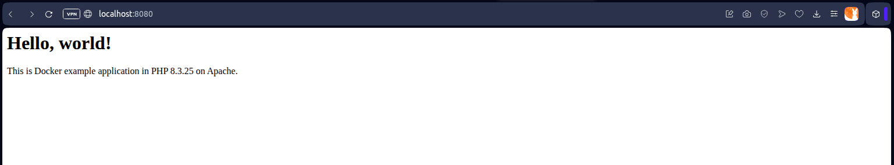
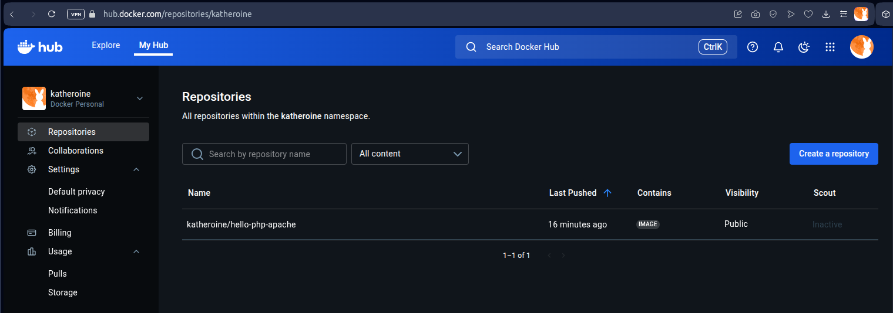

# Example: Hello World web application in PHP on Apache from pre-made image

### Creating Dockerfile

[**Dockerfile**](Dockerfile)

```dockerfile
# Use the official PHP image as the base
FROM php:8.3-apache

# Copy the application files to the container
COPY index.php /var/www/html/

# Expose HTTP port
EXPOSE 80

```

### Creating PHP application sample

[**index.php**](index.php)

```html
<h1>Hello, world!</h1>
<p>This is Docker example application in PHP <?php echo phpversion(); ?> on Apache.</p>

```

### Building image

`docker build -t hello-php-apache .`

* `build` - building a container
* `-t` tags an image with a name
* `hello-php-apache` - image name
* `.` - lets Docker know where it can find the Dockerfile

```console
$ docker build -t hello-php-apache .
[+] Building 42.8s (8/8) FINISHED                                                                                                                                                                                                                                  docker:default
 => [internal] load build definition from Dockerfile                                                                                                                                                                                                                         0.1s
 => => transferring dockerfile: 202B                                                                                                                                                                                                                                         0.0s
 => [internal] load metadata for docker.io/library/php:8.3-apache                                                                                                                                                                                                            2.7s
 => [auth] library/php:pull token for registry-1.docker.io                                                                                                                                                                                                                   0.0s
 => [internal] load .dockerignore                                                                                                                                                                                                                                            0.1s
 => => transferring context: 51B                                                                                                                                                                                                                                             0.0s
 => [internal] load build context                                                                                                                                                                                                                                            0.0s
 => => transferring context: 430B                                                                                                                                                                                                                                            0.0s
 => [1/2] FROM docker.io/library/php:8.3-apache@sha256:963810f068ac26f61e62540f47392aa607a1419895a1c61084c1ffde208e9117                                                                                                                                                     39.2s
 => => resolve docker.io/library/php:8.3-apache@sha256:963810f068ac26f61e62540f47392aa607a1419895a1c61084c1ffde208e9117                                                                                                                                                      0.0s
 => => sha256:b1fdc707494c42458e3bc8fa49c7d2fb3ba9bf7e0c4167b81ebb7da71e88d578 117.84MB / 117.84MB                                                                                                                                                                          17.6s
 => => sha256:ce1261c6d567efa8e3b457673eeeb474a0a8066df6bb95ca9a6a94a31e219dd3 29.77MB / 29.77MB                                                                                                                                                                             5.9s
 => => sha256:c0cdc4d13cbbd81c4da28f0a5177669fb5f957466c2f904f98496f7ee0b40ef2 225B / 225B                                                                                                                                                                                   0.7s
 => => sha256:65c3586f15be30c17ee32401776849b7574387e74f1c470abd78e952b477de9c 11.45kB / 11.45kB                                                                                                                                                                             0.0s
 => => sha256:963810f068ac26f61e62540f47392aa607a1419895a1c61084c1ffde208e9117 10.35kB / 10.35kB                                                                                                                                                                             0.0s
 => => sha256:26db6fd1e10182cd32a75a35444fd0052bae70491c31f556b55623fada127843 3.82kB / 3.82kB                                                                                                                                                                               0.0s
 => => sha256:f7af854b6e1ae3f00efa46e227cb802e00113099fad0730bf0ea79777571937d 226B / 226B                                                                                                                                                                                   1.1s
 => => sha256:27844f0bba07885733a1a891137be2bb42e3b0fd74fad355ec9aeff9fe2dce1e 4.22MB / 4.22MB                                                                                                                                                                               8.0s
 => => sha256:57992caed768086a6c0e311f63782c09831610a3e32216259bdd76df6ae08363 429B / 429B                                                                                                                                                                                   6.2s
 => => extracting sha256:ce1261c6d567efa8e3b457673eeeb474a0a8066df6bb95ca9a6a94a31e219dd3                                                                                                                                                                                    4.0s
 => => sha256:347ae1524e2ad360b24b4ef2387a9461da4891a4b8ef160eae8ec6ad34ca473a 483B / 483B                                                                                                                                                                                   6.5s
 => => sha256:6ce000de9ce8887551c23d5c4567a55797742eb3a0e51305c7bc8cf1fc5ef754 12.75MB / 12.75MB                                                                                                                                                                            10.4s
 => => sha256:8ffb1c55e0d2aad7b78b024ae001e27cce8b007128502a87b156bbd9cbdbe485 489B / 489B                                                                                                                                                                                   8.5s
 => => sha256:8b220f5e801fbe37e7f63103f02b4e2a791105442be23ed365551ac089d56cb8 11.71MB / 11.71MB                                                                                                                                                                            15.0s
 => => extracting sha256:c0cdc4d13cbbd81c4da28f0a5177669fb5f957466c2f904f98496f7ee0b40ef2                                                                                                                                                                                    0.0s
 => => sha256:c39fec0932f30c6ffb2c4b45aff32723c845214ce3c82df80f85e0053d04142d 2.46kB / 2.46kB                                                                                                                                                                              10.7s
 => => sha256:64af9df2d0f46cd215f60de277299b2285ecd1b6d40f305e7d230a2ffe293c65 249B / 249B                                                                                                                                                                                  11.0s
 => => sha256:60d9c4eff296fff77f568ecb99d8c3c58ddf7f4643c37dbc869f973660fef40d 244B / 244B                                                                                                                                                                                  11.4s
 => => sha256:d1fea5d06223ba540e4224bafb4f89d219c75cba16d48a33102d681aca5ac412 889B / 889B                                                                                                                                                                                  11.8s
 => => sha256:4f4fb700ef54461cfa02571ae0db9a0dc1e0cdb5577484a6d75e68dc38e8acc1 32B / 32B                                                                                                                                                                                    12.5s
 => => extracting sha256:b1fdc707494c42458e3bc8fa49c7d2fb3ba9bf7e0c4167b81ebb7da71e88d578                                                                                                                                                                                   14.5s
 => => extracting sha256:f7af854b6e1ae3f00efa46e227cb802e00113099fad0730bf0ea79777571937d                                                                                                                                                                                    0.0s
 => => extracting sha256:27844f0bba07885733a1a891137be2bb42e3b0fd74fad355ec9aeff9fe2dce1e                                                                                                                                                                                    1.1s
 => => extracting sha256:57992caed768086a6c0e311f63782c09831610a3e32216259bdd76df6ae08363                                                                                                                                                                                    0.0s
 => => extracting sha256:347ae1524e2ad360b24b4ef2387a9461da4891a4b8ef160eae8ec6ad34ca473a                                                                                                                                                                                    0.0s
 => => extracting sha256:6ce000de9ce8887551c23d5c4567a55797742eb3a0e51305c7bc8cf1fc5ef754                                                                                                                                                                                    0.6s
 => => extracting sha256:8ffb1c55e0d2aad7b78b024ae001e27cce8b007128502a87b156bbd9cbdbe485                                                                                                                                                                                    0.0s
 => => extracting sha256:8b220f5e801fbe37e7f63103f02b4e2a791105442be23ed365551ac089d56cb8                                                                                                                                                                                    2.6s
 => => extracting sha256:c39fec0932f30c6ffb2c4b45aff32723c845214ce3c82df80f85e0053d04142d                                                                                                                                                                                    0.0s
 => => extracting sha256:64af9df2d0f46cd215f60de277299b2285ecd1b6d40f305e7d230a2ffe293c65                                                                                                                                                                                    0.0s
 => => extracting sha256:60d9c4eff296fff77f568ecb99d8c3c58ddf7f4643c37dbc869f973660fef40d                                                                                                                                                                                    0.0s
 => => extracting sha256:d1fea5d06223ba540e4224bafb4f89d219c75cba16d48a33102d681aca5ac412                                                                                                                                                                                    0.0s
 => => extracting sha256:4f4fb700ef54461cfa02571ae0db9a0dc1e0cdb5577484a6d75e68dc38e8acc1                                                                                                                                                                                    0.0s
 => [2/2] COPY . /var/www/html                                                                                                                                                                                                                                               0.5s
 => exporting to image                                                                                                                                                                                                                                                       0.1s
 => => exporting layers                                                                                                                                                                                                                                                      0.0s
 => => writing image sha256:5dccd00ae7d4e03ab4c224f760b52f23739cf94f56667e884dc6e24d842eb2be                                                                                                                                                                                 0.0s
 => => naming to docker.io/library/hello-php-apache                                                                                                                                                                                                                          0.0s
```

```console
$ docker images
REPOSITORY         TAG       IMAGE ID       CREATED          SIZE
hello-php-apache   latest    5dccd00ae7d4   20 minutes ago   503MB
```

### Creating container

`docker run -d -p 8080:80 --name hello-world-in-php-on-apache hello-php-apache`

* `run` - running new container
* `-d` - detached mode (running in the background)
* `-p 8080:80` - mapping port 8088 on the Docker host to TCP port 80 in the container
* `--name hello-world-in-php-on-apache` - name of the creating container
* `hello-php-apache` - a particular local image

```console
$ docker run -d -p 8080:80 --name hello-world-in-php-on-apache hello-php-apache
c47c43dea513cef679e6a59007a2f06d15c330b2aa0791fada692e65d0b39bad
```

```console
$ docker ps -a
CONTAINER ID   IMAGE              COMMAND                  CREATED             STATUS             PORTS                                     NAMES
c47c43dea513   hello-php-apache   "docker-php-entrypoi…"   About an hour ago   Up About an hour   0.0.0.0:8080->80/tcp, [::]:8080->80/tcp   hello-world-in-php-on-apache
```



### Tagging image

`docker tag hello-php-apache:latest katheroine/hello-php-apache:latest`

* `tag` - create a tag TARGET_IMAGE that refers to SOURCE_IMAGE
* `hello-php-apache:latest` - SOURCE_IMAGE
* `katheroine/hello-php-apache:latest` - TARGET_IMAGE

```console
$ docker tag hello-php-apache:latest katheroine/hello-php-apache:latest
```

```console
$ docker images
REPOSITORY                    TAG       IMAGE ID       CREATED       SIZE
katheroine/hello-php-apache   latest    5dccd00ae7d4   2 hours ago   503MB
hello-php-apache              latest    5dccd00ae7d4   2 hours ago   503MB
```

### Publishing image

`docker push katheroine/hello-php-apache:latest`

* `push` - upload an image to a registry (Docker Hub)
* `katheroine/hello-php-apache:latest` - tagged image

**It requires being logged in to the registry**

```bash
$ docker push katheroine/hello-php-apache:latest
The push refers to repository [docker.io/katheroine/hello-php-apache]
629fbe00c0ff: Pushed
5f70bf18a086: Pushed
360988e3c01b: Pushed
a9b8801312ae: Pushed
5d1a940869ae: Pushed
51dfdc6bdbdd: Pushed
1ff271be157f: Pushed
7a63c97b5645: Pushed
fd5842f3d87e: Pushed
7eeafba3a8b3: Pushed
997263431615: Pushed
d0058afdbd8c: Pushed
146ced886ae9: Pushed
89743deb3e92: Pushed
659308883e40: Pushed
daf557c4f08e: Pushed
latest: digest: sha256:02d731153ed826a614e2e68670b755dcfd860d0761da60d2e6096606fda1d66a size: 3655
```


