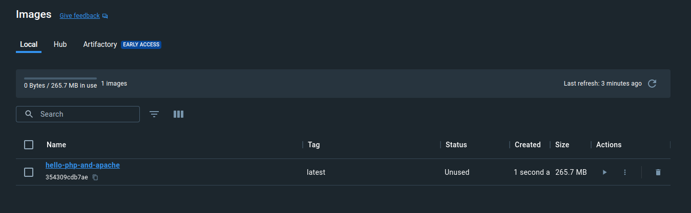
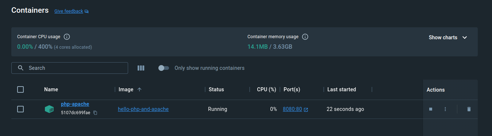
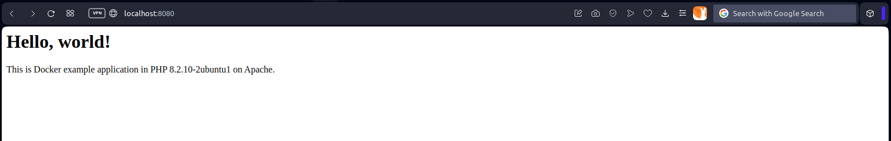

# Example application: Hello World in PHP on Apache

## Creating Dockerfile

**Dockerfile**

```dockerfile
FROM ubuntu:23.10

RUN apt -y update
RUN apt -y upgrade
RUN apt -y install apache2
RUN apt -y install php

RUN mkdir -p /var/www/hello-php-and-apache/public
RUN chmod -R 755 /var/www
COPY site.conf /etc/apache2/sites-available/
COPY index.php /var/www/hello-php-and-apache/public

RUN a2dissite 000-default.conf
RUN a2ensite site.conf

EXPOSE 80

CMD ["apachectl", "-D", "FOREGROUND"]

```

## Preparing PHP application sample

**index.php**

```html
<h1>Hello, world!</h1>
<p>This is Docker example application in PHP <? echo phpversion() ?> on Apache.</p>

```

## Building image

`docker build -t hello-php-and-apache .`

* `build` - building a container
* `-t` tags an image with a name
* `hello-php-and-apache` - image name
* `.` - lets Docker know where it can find the Dockerfile

```bash
$ docker build -t hello-php-and-apache .
[+] Building 4.4s (17/17) FINISHED                                                                                                                                                                                                                           docker:desktop-linux
 => [internal] load build definition from Dockerfile                                                                                                                                                                                                                         0.0s
 => => transferring dockerfile: 423B                                                                                                                                                                                                                                         0.0s
 => [internal] load .dockerignore                                                                                                                                                                                                                                            0.0s
 => => transferring context: 2B                                                                                                                                                                                                                                              0.0s
 => [internal] load metadata for docker.io/library/ubuntu:23.10                                                                                                                                                                                                              2.5s
 => [auth] library/ubuntu:pull token for registry-1.docker.io                                                                                                                                                                                                                0.0s
 => [ 1/11] FROM docker.io/library/ubuntu:23.10@sha256:5cd569b792a8b7b483d90942381cd7e0b03f0a15520d6e23fb7a1464a25a71b1                                                                                                                                                      0.0s
 => [internal] load build context                                                                                                                                                                                                                                            0.0s
 => => transferring context: 172B                                                                                                                                                                                                                                            0.0s
 => CACHED [ 2/11] RUN apt -y update                                                                                                                                                                                                                                         0.0s
 => CACHED [ 3/11] RUN apt -y upgrade                                                                                                                                                                                                                                        0.0s
 => CACHED [ 4/11] RUN apt -y install apache2                                                                                                                                                                                                                                0.0s
 => CACHED [ 5/11] RUN apt -y install php                                                                                                                                                                                                                                    0.0s
 => CACHED [ 6/11] RUN mkdir -p /var/www/hello-php-and-apache/public                                                                                                                                                                                                         0.0s
 => CACHED [ 7/11] RUN chmod -R 755 /var/www                                                                                                                                                                                                                                 0.0s
 => CACHED [ 8/11] COPY site.conf /etc/apache2/sites-available/                                                                                                                                                                                                              0.0s
 => [ 9/11] COPY index.php /var/www/hello-php-and-apache/public                                                                                                                                                                                                              0.2s
 => [10/11] RUN a2dissite 000-default.conf                                                                                                                                                                                                                                   0.6s
 => [11/11] RUN a2ensite site.conf                                                                                                                                                                                                                                           0.5s
 => exporting to image                                                                                                                                                                                                                                                       0.3s
 => => exporting layers                                                                                                                                                                                                                                                      0.2s
 => => writing image sha256:354309cdb7aeefd2dd2f912d1d9d09b68ec95437605c99f3f53b4dcff965ea5a                                                                                                                                                                                 0.0s
 => => naming to docker.io/library/hello-php-and-apache                                                                                                                                                                                                                      0.0s

What's Next?
  View a summary of image vulnerabilities and recommendations → docker scout quickview
```



## Creating container

`docker run -d -p 8080:80 --name php-apache hello-php-and-apache`

* `run` - running new container
* `-d` - detached mode (running in the background)
* `-p 8080:80` - mapping port 8080 on the Docker host to TCP port 80 in the container
* `--name php-apache` - container name
* `hello-php` - a particular local image

```bash
$ docker run -d -p 8080:80 --name php-apache hello-php-and-apache
5107dc699faec15ee866cadc227768eb78d3e2dd98938687365c650031e4978d
```




