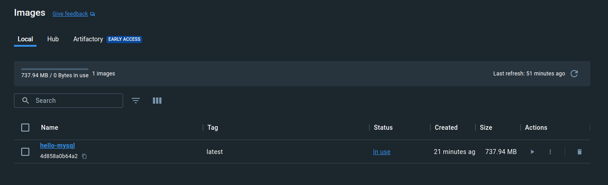
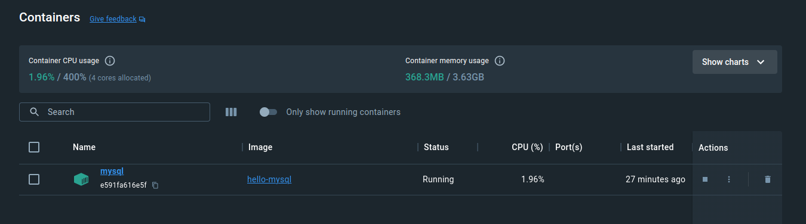
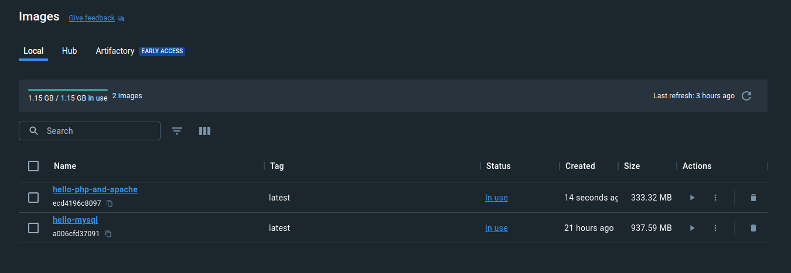
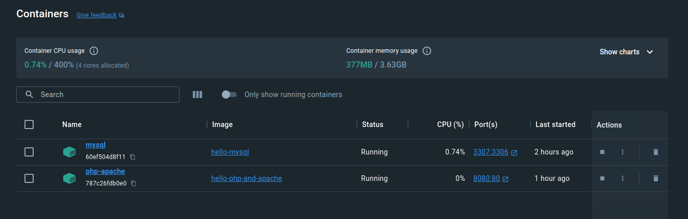
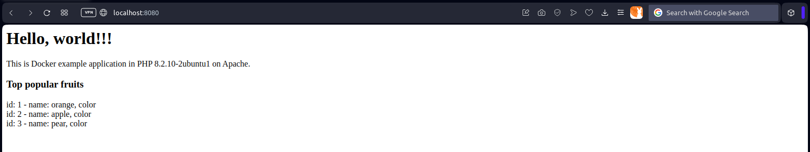

# Example application: Hello World in PHP on Apache with MySQL from scratch - two containers & network

## Creating network

`docker network create php-apache-and-mysql`

## Creating MySQL image & container

### Creating Dockerfile

**Dockerfile**

```dockerfile
FROM ubuntu:23.10

RUN apt -y update
RUN apt -y upgrade
RUN apt -y install mysql-server-8.0

RUN sed -i "s|bind-address		= 127.0.0.1|#bind-address		= 127.0.0.1 |g" /etc/mysql/mysql.conf.d/mysqld.cnf

COPY database.sql /var/tmp/
RUN service mysql start && \
    echo "source /var/tmp/database.sql" | mysql

EXPOSE 3306

CMD mysqld_safe

```

### Preparing SQL script

**database.sql**

```sql
CREATE DATABASE hello;

CREATE USER 'hello' IDENTIFIED BY 'hello';
GRANT ALL ON hello.* TO 'hello'@'%';

USE hello;
CREATE TABLE fruits (
    id int AUTO_INCREMENT PRIMARY KEY,
    name varchar(255),
    colour varchar(255)
);
INSERT INTO fruits
    (name, colour)
VALUES
    ('orange', 'orange'),
    ('apple', 'red'),
    ('pear', 'yellow');

```

### Building image

`docker build -t hello-mysql .`

* `build` - building a container
* `-t` tags an image with a name
* `hello-mysql` - image name
* `.` - lets Docker know where it can find the Dockerfile

```bash
$ docker build -t hello-mysql .
[+] Building 3.1s (13/13) FINISHED                                                                                                                                                                                                                           docker:desktop-linux
 => [internal] load build definition from Dockerfile                                                                                                                                                                                                                         0.1s
 => => transferring dockerfile: 374B                                                                                                                                                                                                                                         0.0s
 => [internal] load .dockerignore                                                                                                                                                                                                                                            0.0s
 => => transferring context: 2B                                                                                                                                                                                                                                              0.0s
 => [internal] load metadata for docker.io/library/ubuntu:23.10                                                                                                                                                                                                              2.8s
 => [auth] library/ubuntu:pull token for registry-1.docker.io                                                                                                                                                                                                                0.0s
 => [1/7] FROM docker.io/library/ubuntu:23.10@sha256:5cd569b792a8b7b483d90942381cd7e0b03f0a15520d6e23fb7a1464a25a71b1                                                                                                                                                        0.0s
 => [internal] load build context                                                                                                                                                                                                                                            0.1s
 => => transferring context: 34B                                                                                                                                                                                                                                             0.0s
 => CACHED [2/7] RUN apt -y update                                                                                                                                                                                                                                           0.0s
 => CACHED [3/7] RUN apt -y upgrade                                                                                                                                                                                                                                          0.0s
 => CACHED [4/7] RUN apt -y install mysql-server-8.0                                                                                                                                                                                                                         0.0s
 => CACHED [5/7] RUN sed -i "s|bind-address  = 127.0.0.1|#bind-address  = 127.0.0.1 |g" /etc/mysql/mysql.conf.d/mysqld.cnf                                                                                                                                                   0.0s
 => CACHED [6/7] COPY database.sql /var/tmp/                                                                                                                                                                                                                                 0.0s
 => CACHED [7/7] RUN service mysql start &&     echo "source /var/tmp/database.sql" | mysql                                                                                                                                                                                  0.0s
 => exporting to image                                                                                                                                                                                                                                                       0.0s
 => => exporting layers                                                                                                                                                                                                                                                      0.0s
 => => writing image sha256:a006cfd37091e280a3012eeaeda9445fae1b876e0879a31ee7e4af1af8ff02e1                                                                                                                                                                                 0.0s
 => => naming to docker.io/library/hello-mysql                                                                                                                                                                                                                               0.0s

What's Next?
  View a summary of image vulnerabilities and recommendations → docker scout quickview
```



### Creating container

`docker run -d -p 3307:3306 --name mysql --network php-apache-and-mysql hello-mysql`

* `run` - running new container
* `-d` - detached mode (running in the background)
* `-p 3307:3306` - mapping port 3307 on the Docker host to TCP port 3306 in the container
* `--name mysql` - container name
* `hello-mysql` - a particular local image

```bash
$ docker run -d -p 3307:3306 --name mysql --network php-apache-and-mysql hello-mysql
60ef504d8f119263398ed738b28035f5bbfdc6fd501edca1a2b5ab00ef7d1c61
```

### Logging into container

`docker exec -it mysl /bin/bash`



## Creating PHP & Apache image & container

### Creating Dockerfile

**Dockerfile**

```dockerfile
FROM ubuntu:23.10

RUN apt -y update
RUN apt -y upgrade
RUN apt -y install php8.2-fpm
RUN apt -y install apache2
RUN apt -y install libapache2-mod-fcgid
RUN apt -y install php8.2-mysql

RUN a2enmod proxy_fcgi
RUN a2enconf php8.2-fpm

RUN mkdir -p /var/www/hello-php-and-apache/public
RUN chmod -R 755 /var/www
COPY site.conf /etc/apache2/sites-available/
COPY index.php /var/www/hello-php-and-apache/public

RUN a2dissite 000-default.conf
RUN a2ensite site.conf

EXPOSE 80

CMD service php8.2-fpm start; apachectl -D FOREGROUND

```

### Preparing PHP application sample

**index.php**

```php
<h1>Hello, world!!!</h1>
<p>This is Docker example application in PHP <?php echo phpversion(); ?> on Apache.</p>

<?php
$connection = new mysqli('mysql', 'hello', 'hello', 'hello');
if ($connection->connect_error) {
  die('Database connection failed: ' . $connection->connect_error);
}
echo('<h3>Top popular fruits</h3>');
$result = $connection->query('SELECT * FROM fruits');
if ($result->num_rows > 0) {
  while($row = $result->fetch_assoc()) {
    echo('<div>id: ' . $row['id']. ' - name: ' . $row['name']. ', color ' . $row['color']. '</div>');
  }
} else {
  echo("<p>No items in the database.</p>");
}
$connection->close();
?>

```

### Building image

`docker build -t hello-php-and-apache .`

* `build` - building a container
* `-t` tags an image with a name
* `hello-php-and-apache` - image name
* `.` - lets Docker know where it can find the Dockerfile

```bash
$ docker build -t hello-php-and-apache .
[+] Building 3.3s (21/21) FINISHED                                                                                                                                                                                                                           docker:desktop-linux
 => [internal] load build definition from Dockerfile                                                                                                                                                                                                                         0.0s
 => => transferring dockerfile: 567B                                                                                                                                                                                                                                         0.0s
 => [internal] load .dockerignore                                                                                                                                                                                                                                            0.0s
 => => transferring context: 2B                                                                                                                                                                                                                                              0.0s
 => [internal] load metadata for docker.io/library/ubuntu:23.10                                                                                                                                                                                                              2.3s
 => [auth] library/ubuntu:pull token for registry-1.docker.io                                                                                                                                                                                                                0.0s
 => [internal] load build context                                                                                                                                                                                                                                            0.0s
 => => transferring context: 700B                                                                                                                                                                                                                                            0.0s
 => [ 1/15] FROM docker.io/library/ubuntu:23.10@sha256:5cd569b792a8b7b483d90942381cd7e0b03f0a15520d6e23fb7a1464a25a71b1                                                                                                                                                      0.0s
 => CACHED [ 2/15] RUN apt -y update                                                                                                                                                                                                                                         0.0s
 => CACHED [ 3/15] RUN apt -y upgrade                                                                                                                                                                                                                                        0.0s
 => CACHED [ 4/15] RUN apt -y install php8.2-fpm                                                                                                                                                                                                                             0.0s
 => CACHED [ 5/15] RUN apt -y install apache2                                                                                                                                                                                                                                0.0s
 => CACHED [ 6/15] RUN apt -y install libapache2-mod-fcgid                                                                                                                                                                                                                   0.0s
 => CACHED [ 7/15] RUN apt -y install php8.2-mysql                                                                                                                                                                                                                           0.0s
 => CACHED [ 8/15] RUN a2enmod proxy_fcgi                                                                                                                                                                                                                                    0.0s
 => CACHED [ 9/15] RUN a2enconf php8.2-fpm                                                                                                                                                                                                                                   0.0s
 => CACHED [10/15] RUN mkdir -p /var/www/hello-php-and-apache/public                                                                                                                                                                                                         0.0s
 => CACHED [11/15] RUN chmod -R 755 /var/www                                                                                                                                                                                                                                 0.0s
 => CACHED [12/15] COPY site.conf /etc/apache2/sites-available/                                                                                                                                                                                                              0.0s
 => [13/15] COPY index.php /var/www/hello-php-and-apache/public                                                                                                                                                                                                              0.0s
 => [14/15] RUN a2dissite 000-default.conf                                                                                                                                                                                                                                   0.3s
 => [15/15] RUN a2ensite site.conf                                                                                                                                                                                                                                           0.3s
 => exporting to image                                                                                                                                                                                                                                                       0.1s
 => => exporting layers                                                                                                                                                                                                                                                      0.1s
 => => writing image sha256:ecd4196c8097adb258a81d99e0ebd09ff7c9a7e18decf37d48dad1197cad4c19                                                                                                                                                                                 0.0s
 => => naming to docker.io/library/hello-php-and-apache                                                                                                                                                                                                                      0.0s

What's Next?
  View a summary of image vulnerabilities and recommendations → docker scout quickview
```



### Creating container

`docker run -d -p 8080:80 --name php-apache --network php-apache-and-mysql hello-php-and-apache`

* `run` - running new container
* `-d` - detached mode (running in the background)
* `-p 8080:80` - mapping port 8080 on the Docker host to TCP port 80 in the container
* `--name mysql` - container name
* `hello-mysql` - a particular local image

```bash
$ docker run -d -p 8080:80 --name php-apache --network php-apache-and-mysql hello-php-and-apache
787c26fdb0e082a7d30e4763c5cff251d7e74ddb3b2292cc2d3b0d3f83ad3754
```



## Logging into container

`docker exec -it php-apache /bin/bash`


