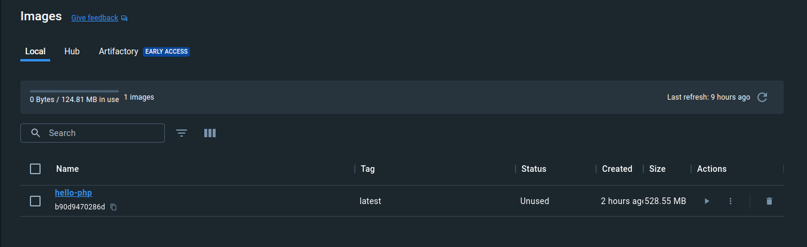
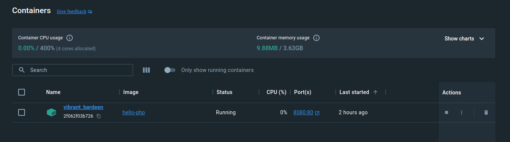
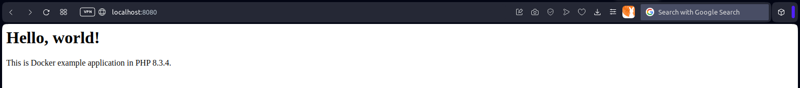
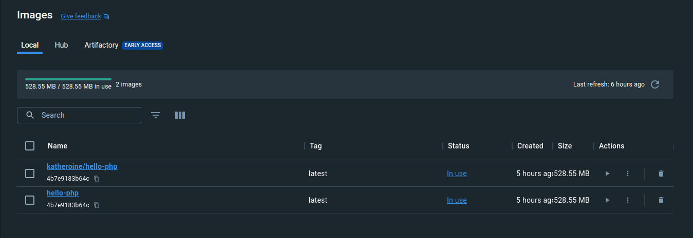
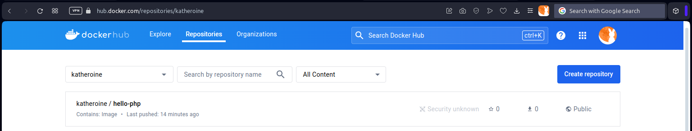

# Example application: Hello World in PHP

## Creating Dockerfile

**Dockerfile**

```dockerfile
# Use the official PHP 8.0 image as the base
FROM php:8.3-apache

# Install system dependencies
RUN apt-get update && apt-get install -y \
    libzip-dev \
    unzip \
    && docker-php-ext-install zip pdo_mysql

# Enable Apache rewrite module
RUN a2enmod rewrite

# Set the document root to Laravel's public directory
ENV APACHE_DOCUMENT_ROOT /var/www/html/public

# Copy the application files to the container
COPY . /var/www/html

# Set the working directory
WORKDIR /var/www/html
```

## Creating PHP application sample

**index.php**

```html
<h1>Hello, world!</h1>
<p>This is Docker example application in PHP <? echo phpversion() ?>.</p>

```

## Building image

`docker build -t hello-php .`

* `build` - building a container
* `-t` tags an image with a name
* `hello-php` - image name
* `.` - lets Docker know where it can find the Dockerfile

```bash
$ docker build -t hello-php .
[+] Building 90.6s (10/10) FINISHED                                                                                                                                                                                                                          docker:desktop-linux
 => [internal] load build definition from Dockerfile                                                                                                                                                                                                                         0.1s
 => => transferring dockerfile: 522B                                                                                                                                                                                                                                         0.0s
 => [internal] load .dockerignore                                                                                                                                                                                                                                            0.1s
 => => transferring context: 680B                                                                                                                                                                                                                                            0.0s
 => [internal] load metadata for docker.io/library/php:8.3-apache                                                                                                                                                                                                            2.9s
 => [1/5] FROM docker.io/library/php:8.3-apache@sha256:3a042ba70387a239c4d587ebef1ba10e405637d69c01e1702b7cbe6c8f523077                                                                                                                                                     52.9s
 => => resolve docker.io/library/php:8.3-apache@sha256:3a042ba70387a239c4d587ebef1ba10e405637d69c01e1702b7cbe6c8f523077                                                                                                                                                      0.1s
 => => sha256:f83c7e0de36dea6fbd6885dea315b312e340d91017b5d4cfb3626b6c9ede3092 3.04kB / 3.04kB                                                                                                                                                                               0.0s
 => => sha256:8a1e25ce7c4f75e372e9884f8f7b1bedcfe4a7a7d452eb4b0a1c7477c9a90345 29.12MB / 29.12MB                                                                                                                                                                            19.2s
 => => sha256:5de14226e1706b621fe796af63b375db247a2490752558ed4f5ea40648234129 225B / 225B                                                                                                                                                                                   0.3s
 => => sha256:3a042ba70387a239c4d587ebef1ba10e405637d69c01e1702b7cbe6c8f523077 1.86kB / 1.86kB                                                                                                                                                                               0.0s
 => => sha256:01a08dfbcef3559aaccbe086029ae5d8320a052b749421f86bebcdb3d5d25f33 12.82kB / 12.82kB                                                                                                                                                                             0.0s
 => => sha256:d5aaf617d1d2bc41efbec77e9f05370e6f35d8f4363fb26fa04883ec538b7d66 104.36MB / 104.36MB                                                                                                                                                                          38.4s
 => => sha256:d3ba065e262ff15c57d91609cae32d80920edac1e9b0826e0d8cf5f0f3c60107 270B / 270B                                                                                                                                                                                   0.8s
 => => sha256:142ecae067f5d5cbf3c2a3cf42d5677472bc8cc633b8ccea33d011749bb84661 20.30MB / 20.30MB                                                                                                                                                                            11.6s
 => => sha256:c1f1b407f7499799755557f8769bbeb98d0573d6092913d5303cf951acdace0b 476B / 476B                                                                                                                                                                                  12.2s
 => => sha256:6a1b2cfb806df514ad4cf5cffa00c66aaa6322c1ef8f3b1c597592771925569b 512B / 512B                                                                                                                                                                                  12.5s
 => => sha256:7214a7d8b094ac5c57e27a6253262bf227c0bd2f9e15b0a2baa340c33f2a8b67 12.78MB / 12.78MB                                                                                                                                                                            21.6s
 => => extracting sha256:8a1e25ce7c4f75e372e9884f8f7b1bedcfe4a7a7d452eb4b0a1c7477c9a90345                                                                                                                                                                                    5.7s
 => => sha256:e1e055f8d0e6b4159ee0c461adbf769594edd20f18c9452f610634d55c779222 492B / 492B                                                                                                                                                                                  20.0s
 => => sha256:6c09d823b2a82ecea49c91ada6d5e2eb007cc3815199485a624224c95f8a4ca8 11.63MB / 11.63MB                                                                                                                                                                            26.6s
 => => sha256:8eb2c18412fea4b68876e78655cf262c7ec42e56f21ed7d33c4866239d7f2eef 2.46kB / 2.46kB                                                                                                                                                                              21.8s
 => => sha256:68596cb92282dcf2b87dfc2cc4b71ecf8d3cf0c6286578e1b206960c5d088957 245B / 245B                                                                                                                                                                                  22.0s
 => => sha256:e37124bcfe26d6cd8cac9cc0eb3316b0568d5f2be37d63bc4e554aa4b026f2fd 895B / 895B                                                                                                                                                                                  22.3s
 => => extracting sha256:5de14226e1706b621fe796af63b375db247a2490752558ed4f5ea40648234129                                                                                                                                                                                    0.0s
 => => extracting sha256:d5aaf617d1d2bc41efbec77e9f05370e6f35d8f4363fb26fa04883ec538b7d66                                                                                                                                                                                    7.2s
 => => extracting sha256:d3ba065e262ff15c57d91609cae32d80920edac1e9b0826e0d8cf5f0f3c60107                                                                                                                                                                                    0.0s
 => => extracting sha256:142ecae067f5d5cbf3c2a3cf42d5677472bc8cc633b8ccea33d011749bb84661                                                                                                                                                                                    1.1s
 => => extracting sha256:c1f1b407f7499799755557f8769bbeb98d0573d6092913d5303cf951acdace0b                                                                                                                                                                                    0.0s
 => => extracting sha256:6a1b2cfb806df514ad4cf5cffa00c66aaa6322c1ef8f3b1c597592771925569b                                                                                                                                                                                    0.0s
 => => extracting sha256:7214a7d8b094ac5c57e27a6253262bf227c0bd2f9e15b0a2baa340c33f2a8b67                                                                                                                                                                                    0.2s
 => => extracting sha256:e1e055f8d0e6b4159ee0c461adbf769594edd20f18c9452f610634d55c779222                                                                                                                                                                                    0.0s
 => => extracting sha256:6c09d823b2a82ecea49c91ada6d5e2eb007cc3815199485a624224c95f8a4ca8                                                                                                                                                                                    1.0s
 => => extracting sha256:8eb2c18412fea4b68876e78655cf262c7ec42e56f21ed7d33c4866239d7f2eef                                                                                                                                                                                    0.0s
 => => extracting sha256:68596cb92282dcf2b87dfc2cc4b71ecf8d3cf0c6286578e1b206960c5d088957                                                                                                                                                                                    0.0s
 => => extracting sha256:e37124bcfe26d6cd8cac9cc0eb3316b0568d5f2be37d63bc4e554aa4b026f2fd                                                                                                                                                                                    0.0s
 => [internal] load build context                                                                                                                                                                                                                                            0.1s
 => => transferring context: 110B                                                                                                                                                                                                                                            0.0s
 => [2/5] RUN apt-get update && apt-get install -y     libzip-dev     unzip     && docker-php-ext-install zip pdo_mysql                                                                                                                                                     33.5s
 => [3/5] RUN a2enmod rewrite                                                                                                                                                                                                                                                0.4s
 => [4/5] COPY . /var/www/html                                                                                                                                                                                                                                               0.1s
 => [5/5] WORKDIR /var/www/html                                                                                                                                                                                                                                              0.1s
 => exporting to image                                                                                                                                                                                                                                                       0.3s
 => => exporting layers                                                                                                                                                                                                                                                      0.3s
 => => writing image sha256:8f4bba4c8c606c0630dee889da7fdd18acc47ff57d923d2e51c19aecfa02dfc5                                                                                                                                                                                 0.0s
 => => naming to docker.io/library/hello-php                                                                                                                                                                                                                                 0.0s

What's Next?
  View a summary of image vulnerabilities and recommendations → docker scout quickview

```



## Creating container

`docker run -d -p 8080:80 hello-php`

* `run` - running new container
* `-d` - detached mode (running in the background)
* `-p 8080:80` - mapping port 8088 on the Docker host to TCP port 80 in the container
* `hello-php` - a particular local image

```bash
$ docker run -d -p 8080:80 hello-php
2f062f03b726b2de5c393a029367459eef0a38aff592f5fd51b151fa94e98827
```





## Tagging image

`docker tag hello-php:latest katheroine/hello-php:latest`

* `tag` - create a tag TARGET_IMAGE that refers to SOURCE_IMAGE
* `hello-php:latest` - SOURCE_IMAGE
* `katheroine/hello-php:latest` - TARGET_IMAGE

```bash
$ docker tag hello-php:latest katheroine/hello-php:latest
```



## Publishing image

`docker push katheroine/hello-php:latest`

* `push` - upload an image to a registry (Docker Hub)
* `katheroine/hello-php:latest` - tagged image

**It requires being logged in to the registry**

```bash
$ docker push katheroine/hello-php:latest
The push refers to repository [docker.io/katheroine/hello-php]
5f70bf18a086: Mounted from nicolaka/netshoot
fd6834dd5b08: Pushed
a826f541fde3: Pushed
d6237b70079a: Pushed
3b170ef664d9: Mounted from library/php
4a93e3786ef5: Mounted from library/php
68d2dfc046eb: Mounted from library/php
0c61f43e6df2: Mounted from library/php
7764f0fe5466: Mounted from library/php
292c23e60187: Mounted from library/php
3ac360b81782: Mounted from library/php
76883a98d179: Mounted from library/php
03d7c3cdc80f: Mounted from library/php
e691f3ea106b: Mounted from library/php
af92c2132539: Mounted from library/php
20424b33f94c: Mounted from library/php
a483da8ab3e9: Mounted from library/php
latest: digest: sha256:df80f69f0bdae6d737551ba2df4c7390e10a7d01560e8b45e430d803321b9f7e size: 3868
```


