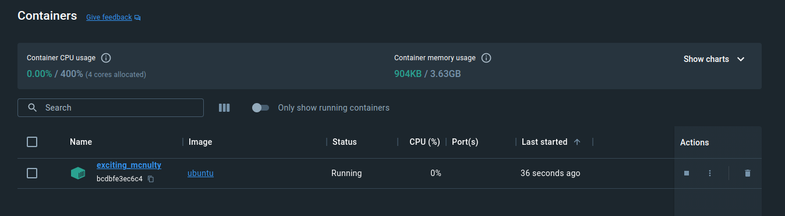

# Simple cases

## Creating containers

`docker run -i -t ubuntu /bin/bash`

* `run` - running new container (appropriate image will be downloaded if has not been downloaded yet)
* `-i` - interactively
* `-t` - attached to host's terminal (user can provide input using the keyboard and see the output)
* `ubuntu` - used image
* `bin/bash` - executed by the container after start

```bash
$ docker run -i -t ubuntu /bin/bash
Unable to find image 'ubuntu:latest' locally
latest: Pulling from library/ubuntu
bccd10f490ab: Pull complete
Digest: sha256:77906da86b60585ce12215807090eb327e7386c8fafb5402369e421f44eff17e
Status: Downloaded newer image for ubuntu:latest
root@bcdbfe3ec6c4:/# ls
bin  boot  dev  etc  home  lib  lib32  lib64  libx32  media  mnt  opt  proc  root  run  sbin  srv  sys  tmp  usr  var
root@bcdbfe3ec6c4:/# cat /etc/issue
Ubuntu 22.04.4 LTS \n \l
```




```bash
root@bcdbfe3ec6c4:/# exit
exit
```


